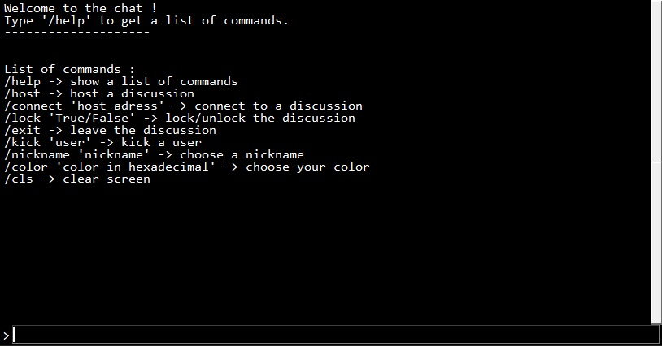

# Python-LAN-Chat

This is a simple LAN chat with a windows console style.
## Features
- Host a discussion or connect to a discussion
- Possibility to lock a discussion
- Possibility to change nickname or color of your messages
- Possibility to kick users
## Installation
1. Download the repository by clicking on `Code > Download ZIP`
2. Extract the ZIP file
3. Run `main.pyw`
## Requirements
- Python 3.7
- Python `tkinter` library
- Python `socket` library
- Python `threading` library
- Python `random` library
- Python `time` library
## Usage
To send a message you have to use `ENTER` after typing something.

All commands start with a `/`.

To get the list of commands just type `/help`.